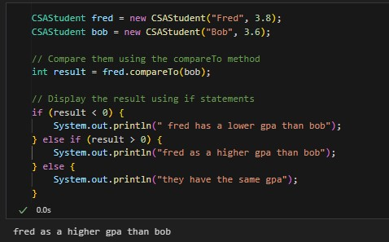

### Lesson Questions
1. !(true)&&(false) = ? what in boolean values?
- !(false)
- true
2. not ((((true and not (false)) ^ false) ^ true) && false) (remember PEMDASNAO!)
- not ((((true and true) ^ false) ^ true) && false)
- not (((true ^ false) ^ true) && false)
- not ((true ^ true) && false)
- not (false && false)
- not (false)
- true
3. Prove the following: !A * !(B + !C) = !A * (!B * !C)
- De Morgan's Law states that

 the second statement is the first statement rewritten
4. 420 && 66 (Hint, convert to binary, then perform the operation)
- 110100100 && 1000010
- false
   1. If you got this one, try 89 OR 42
   - 1011001 or 101010
   - false or false
   - false

   Now that you know what boolean expressions are and how to write them, as well as several comparison methods, your task is to write a class that uses either the compareTo or comparator and compare. Then create two instances of these classes and demonstrate using if statements. 


BONUS: Create a program that checks if a year is a leap year or not.

Here is how the method should work: 

(1) Prompt the user to input any year that they would like <br>
(2) Determine if the year is a leap year or not <br>
(3) Print the necessary dialogue (ex. [year] is/is not a leap year) AND return the value of any boolean(s) used
```java
public class CSAStudent implements Comparable<CSAStudent> {
    private String name;
    private double gpa;

    public CSAStudent(String name, double gpa) {
        this.name = name;
        this.gpa = gpa;
    }

    // Getters
    public String getName() {
        return name;
    }

    public double getGpa() {
        return gpa;
    }

    // Override the compareTo
    public int compareTo(CSAStudent other) {
        if (this.gpa < other.gpa) {
            return -1;
        } else if (this.gpa > other.gpa) {
            return 1;
        } else {
            return 0;
        }
    }
}
```

Print
```java
CSAStudent fred = new CSAStudent("Fred", 3.8);
CSAStudent bob = new CSAStudent("Bob", 3.6);

// Compare them using the compareTo method
int result = fred.compareTo(bob);

// Display the result using if statements
if (result < 0) {
    System.out.println(" fred has a lower gpa than bob");
} else if (result > 0) {
    System.out.println("fred as a higher gpa than bob");
} else {
    System.out.println("they have the same gpa");
}
```



## Extra

```java
import java.util.Scanner;

public static boolean isLeapYear(int year) {
    return (year % 4 == 0 && year % 100 != 0) || (year % 400 == 0);
}

public static void main(String[] args) {

// Getting input
Scanner sc = new Scanner(System.in);

System.out.print("Enter year: ");
int year = sc.nextInt();

boolean result = isLeapYear(year);
if (result) {
    System.out.println(year + " is a leap year.");
} else {
    System.out.println(year + " is not a leap year.");
}

sc.close();
}
```

<style>
    pre {
        background-color: black;
    }

</style>