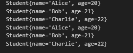
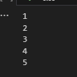

## List Memory Popcorn Hacks
```java
int [] listOne = new int[5]; // Our list looks like [0, 0, 0, 0, 0]

listOne[2] = 33; // Our list looks like [0, 0, 33, 0, 0]
listOne[3] = listOne[2] * 3; // Our list looks like [0, 0, 33, 99, 0]

try {
    listOne[5] = 13; // This will return an error
} catch (Exception e) {
    // System.out.println("Error at listOne[5] = 13");
    // System.out.println("ArrayIndexOutOfBoundsException: We can't access a memory index that doesn't exist!");
}

System.out.println(listOne); // THIS DOES NOT PRINT THE LIST!! It prints the value in memory
System.out.println(listOne[4]); // This will actually print the vaules in the array

System.out.print("[");
for (int i = 0; i < listOne.length; i++) {
    if (i > 0) {
        System.out.print(", ");
    }
    System.out.print(listOne[i]);
}
System.out.println("]");
```

<h4> Output </h4>


## Refrence Elements Popcorn hacks!

Use a class that you have already created and create a list of objects of that class. Then, iterate through the list and print out each object using:
 1) a for loop
 2) a while loop

```java
import java.util.ArrayList;
import java.util.List;

public class Main {
    public static void main(String[] args) {
        List<Student> students = new ArrayList<>();
        students.add(new Student("Alice", 20));
        students.add(new Student("Bob", 21));
        students.add(new Student("Charlie", 22));

        // for loop
        for (int i = 0; i < students.size(); i++) {
            System.out.println(students.get(i));
        }

        // while loop
        int i = 0;
        while (i < students.size()) {
            System.out.println(students.get(i));
            i++;
        }
    }
}

Main.main(null);
```
<h4> Output </h4>



## Enhanced For Loops Popcorn Hacks
Create an array, then use a enhanced for loop to print out each element of the array.

```java
/* Popcorn hacks go here */

int[] array = {1, 2, 3, 4, 5};

for (int number : array) {
    System.out.println(number);
}
```
<h4> Output </h4>



## Min Maxing Popcorn Hacks
Create two lists: one of ints and one of doubles. Use both a standard for loop and an enhanced for loop to find the max and min of each list.

```java
/* Popcorn hacks go here! */
import java.util.Arrays;
import java.util.List;

public class Main {
    public static void main(String[] args) {
        List<Integer> intList = Arrays.asList(1, 2, 3, 4, 5);
        List<Double> doubleList = Arrays.asList(1.1, 2.2, 3.3, 4.4, 5.5);

        // standard for loop
        int intMax = Integer.MIN_VALUE;
        int intMin = Integer.MAX_VALUE;
        for (int i = 0; i < intList.size(); i++) {
            intMax = Math.max(intMax, intList.get(i));
            intMin = Math.min(intMin, intList.get(i));
        }
        System.out.println("Integer List - Max: " + intMax + ", Min: " + intMin);

        double doubleMax = Double.NEGATIVE_INFINITY;
        double doubleMin = Double.POSITIVE_INFINITY;
        for (int i = 0; i < doubleList.size(); i++) {
            doubleMax = Math.max(doubleMax, doubleList.get(i));
            doubleMin = Math.min(doubleMin, doubleList.get(i));
        }
        System.out.println("Double List - Max: " + doubleMax + ", Min: " + doubleMin);

        // enhanced for loop
        intMax = Integer.MIN_VALUE;
        intMin = Integer.MAX_VALUE;
        for (int num : intList) {
            intMax = Math.max(intMax, num);
            intMin = Math.min(intMin, num);
        }
        System.out.println("Integer List - Max: " + intMax + ", Min: " + intMin);

        doubleMax = Double.NEGATIVE_INFINITY;
        doubleMin = Double.POSITIVE_INFINITY;
        for (double num : doubleList) {
            doubleMax = Math.max(doubleMax, num);
            doubleMin = Math.min(doubleMin, num);
        }
        System.out.println("Double List - Max: " + doubleMax + ", Min: " + doubleMin);
    }
}

Main.main(null);
```

<h4> Output </h4>


## Hacks! (Due 10/22 11:59 PM)
Given an input of N integers, find A, the maximum, B, the minimum, and C the median.
 
- Print the following in this order: A + B + C A - B - C (A + B) * C

Sample data:

- I: 1 2 3 4 5
- O: 9 1 18

- I: 2 4 6 8 10 12 14 16
- O: 28 6 180

```java
import java.util.Arrays;

public class Main {
    public static void main(String[] args) {
        int[] numbers1 = {1, 2, 3, 4, 5};
        int[] numbers2 = {2, 4, 6, 8, 10, 12, 14, 16};
        
        printResults(numbers1);
        printResults(numbers2);
    }

    public static void printResults(int[] numbers) {
        Arrays.sort(numbers);
        
        int A = numbers[numbers.length - 1]; // max
        int B = numbers[0]; // min
        int C = numbers[numbers.length / 2]; // median
        
        System.out.println((A + B + C) + " " + (A - B - C) + " " + ((A + B) * C));
    }
}
```
<h4>Output</h4>


For extra, create your own fun program using an array

```java
import java.util.Random;

public class Main {
    public static void main(String[] args) {
        String[] favoriteFoods = {"Pizza", "Burger", "Pasta", "Sushi", "Tacos", "Salad", "Steak"};

        Random rand = new Random();
        int randomIndex = rand.nextInt(favoriteFoods.length);

        System.out.println("How about having " + favoriteFoods[randomIndex] + " for dinner tonight?");
    }
}
```


<style>
    pre {
        background-color: lavenderblush;
    }

</style>